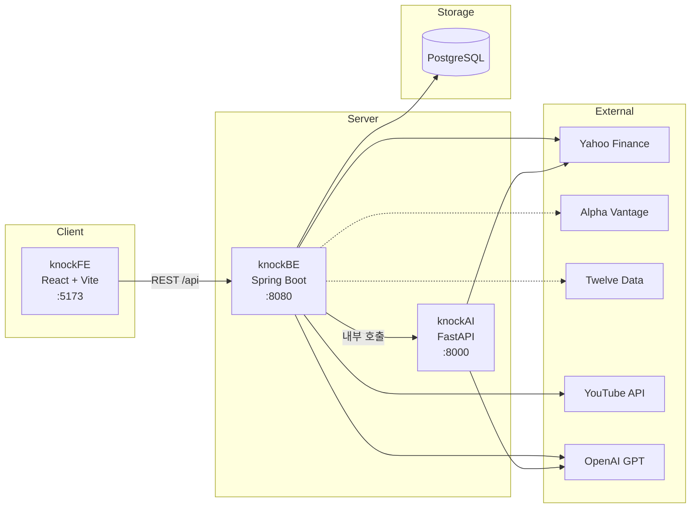
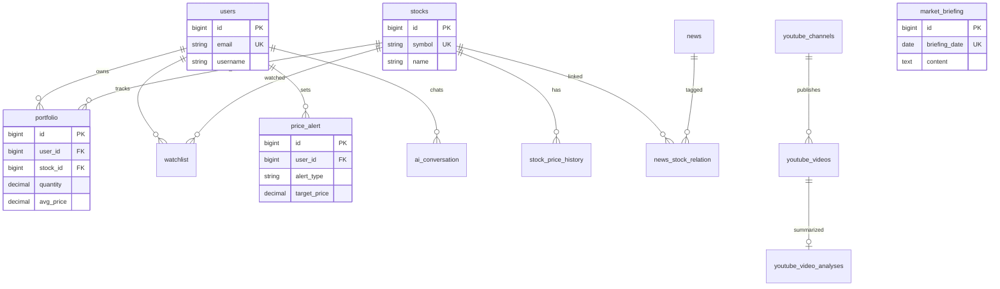

# StocKKnock


국내·해외 주식 투자자를 위한 AI 기반 통합 주식 분석 플랫폼입니다. 실시간 시세, AI 시장 브리핑, 포트폴리오 관리, 가격 알림을 한곳에서 제공합니다.

| 항목 | 내용 |
|------|------|
| **상태** | 개발 중 |
| **유형** | 개인 프로젝트 (1인 풀스택) |

---

## 목차

- [소개](#소개)
- [주요 기능](#주요-기능)
- [기술 스택](#기술-스택)
- [시스템 구조](#시스템-구조)
- [데이터베이스 설계](#데이터베이스-설계)
- [외부 API 키 및 필수 기능](#외부-api-키-및-필수-기능)
- [프로젝트 구조](#프로젝트-구조)
- [시작하기](#시작하기)
- [상세 문서](#상세-문서)
- [보안 · API 키 관리](#보안--api-키-관리)
- [참고](#참고)

---

## 소개

StocKKnock은 보유 주식 관리부터 GPT 기반 시장 분석, 뉴스·유튜버 영상 요약까지 투자에 필요한 정보를 통합한 웹 서비스입니다. Spring Boot가 인증·비즈니스 로직을 담당하고, FastAPI가 AI·데이터 분석을 처리하는 하이브리드 구조로 설계했습니다.

---

## 주요 기능

| 기능 | 설명 |
|------|------|
| **실시간 주가** | Yahoo Finance 등 외부 API 연동, 시장 개장 시간(평일 09:00–15:30)에만 1분마다 갱신 |
| **오늘의 시장 브리핑** | GPT 일일 시장 요약 (평일 1회 생성, DB 캐시) |
| **유튜버 브리핑** | 화이트리스트 채널 신규 영상 수집 → GPT 요약 (핵심 전망 / 언급 종목 / 투자 톤) |
| **포트폴리오** | 보유 종목 관리, 손익 계산, AI 종합 분석 (해시 기반 캐싱으로 재분석 방지) |
| **가격 알림** | 목표가·손절가·변동률 기준 알림, 30초마다 조건 체크 |
| **AI 채팅** | 문맥 유지 대화형 AI 애널리스트 (최근 5개 대화 기반) |
| **뉴스 피드** | 최근 7일 뉴스, 종목별 필터, 뉴스·유튜버 브리핑 탭 |
| **관심 종목** | 사용자별 관심 종목 추가·삭제 |

---

## 기술 스택

| 영역 | 기술 |
|------|------|
| **Frontend** (`knockFE`) | React 19, TypeScript, Vite, TanStack Query, Recharts |
| **Backend** (`knockBE`) | Spring Boot, Java 17, Spring Security, JWT, JPA |
| **AI Service** (`knockAI`) | Python, FastAPI, OpenAI, APScheduler, yfinance, pandas |
| **Database** | PostgreSQL (로컬 또는 Supabase) |
| **외부 API** | Yahoo Finance, Alpha Vantage, Twelve Data, YouTube Data API v3 |

---

## 시스템 구조



> 프론트엔드는 Spring Boot만 호출합니다. FastAPI는 백엔드에서 내부적으로 호출합니다.

---

## 데이터베이스 설계

PostgreSQL + JPA. 주요 엔티티:



| 테이블 | 설명 |
|--------|------|
| `users` / `email_verification` | 사용자·이메일 인증 |
| `stocks` / `stock_price_history` | 종목·시세 이력 |
| `portfolio` / `portfolio_analysis` | 보유 종목·AI 분석 캐시 |
| `watchlist` | 관심 종목 |
| `price_alert` | 가격 알림 |
| `news` / `news_stock_relation` | 뉴스·종목 연관 |
| `market_briefing` | 일일 시장 브리핑 (DB 캐시) |
| `youtube_channels` / `youtube_videos` / `youtube_video_analyses` | 유튜버 브리핑 |
| `ai_conversation` | AI 채팅 기록 |

> 상세 스키마: [FORDEV.md](./FORDEV.md)

---

## 외부 API 키 및 필수 기능

| 환경 변수 | 필수 | 연동 기능 | 없을 때 |
|-----------|------|-----------|---------|
| `DB_URL` / `DB_USERNAME` / `DB_PASSWORD` | ✅ | 전체 서비스 | 서버 시작 불가 |
| `SKJWT_SECRET` | ✅ | 회원 인증·JWT | 인증 불가 |
| `OPENAI_API_KEY` | ✅ | 시장 브리핑, AI 채팅, 포트폴리오 분석, 유튜버 요약 | AI 기능 비활성 |
| `FASTAPI_BASE_URL` | ✅ | knockBE → knockAI 내부 호출 | AI·스케줄러 실패 |
| `YOUTUBE_API_KEY` | 유튜버 브리핑 시 | 채널 영상 수집 | 유튜버 브리핑 비활성 |
| `ALPHA_VANTAGE_API_KEY` | 선택 | 보조 주가 API | Yahoo Finance만 사용 |
| `TWELVE_DATA_API_KEY` | 선택 | 보조 주가 API | Yahoo Finance만 사용 |
| `MAIL_USERNAME` / `MAIL_PASSWORD` | 선택 | 가격 알림 이메일 | 이메일 알림 비활성 |

> 템플릿: `knockBE/.env.example`, `knockAI/.env.example`

| 외부 API | 용도 | 비고 |
|----------|------|------|
| Yahoo Finance (yfinance) | 실시간·과거 시세 | API 키 불필요 |
| OpenAI GPT | 브리핑, 채팅, 분석, 요약 | `gpt-4o-mini` 기본 |
| YouTube Data API v3 | 유튜버 영상 수집 | 화이트리스트 채널만 |
| Alpha Vantage / Twelve Data | 보조 시세 | 폴백·교차 검증용 |

---

## 프로젝트 구조

```
stockknock/
├── knockFE/        # 프론트엔드 (React + Vite)
├── knockBE/        # 백엔드 (Spring Boot) — 인증, 포트폴리오, 알림
├── knockAI/        # AI 서비스 (FastAPI) — GPT, 뉴스, 스케줄러
├── quick_start.sh  # 빠른 시작 스크립트
├── ARCHITECTURE.md # 아키텍처 상세
└── FORDEV.md       # 개발 가이드 · DB 스키마
```

---

## 시작하기

### 사전 요구사항

- Node.js 18+, Java 17+, Python 3.9+, PostgreSQL

### 빠른 시작

```bash
chmod +x quick_start.sh && ./quick_start.sh
```

### 수동 실행

```bash
# 환경 변수
cp knockBE/.env.example knockBE/.env
cp knockAI/.env.example knockAI/.env

# 터미널 1 — 백엔드
cd knockBE && set -a && source .env && set +a && ./gradlew bootRun

# 터미널 2 — AI 서비스
cd knockAI && source venv/bin/activate && uvicorn app.main:app --reload

# 터미널 3 — 프론트엔드
cd knockFE && npm install && npm run dev
```

| 서비스 | URL |
|--------|-----|
| 프론트엔드 | `http://localhost:5173` |
| Swagger UI | `http://localhost:8080/swagger-ui.html` |
| FastAPI | `http://localhost:8000` |

---

## 상세 문서

| 문서 | 내용 |
|------|------|
| [ARCHITECTURE.md](./ARCHITECTURE.md) | Spring + FastAPI 하이브리드 아키텍처 |
| [FORDEV.md](./FORDEV.md) | API 엔드포인트, DB 스키마, 개발 가이드 |
| [SECRET_ROTATION_CHECKLIST.md](./SECRET_ROTATION_CHECKLIST.md) | 시크릿 로테이션 체크리스트 |

---

## 보안 · API 키 관리

- `.env` 파일은 `.gitignore` 처리, `.env.example`에는 placeholder만 포함
- 코드베이스에 하드코딩된 API 키 없음
- `knockFE`는 API 키를 보관하지 않음 — 모든 외부 호출은 `knockBE`/`knockAI` 경유
- 유튜버 브리핑: 자막 원문은 DB에 저장하지 않음 (요약·종목·톤만 저장)

---

## 참고

- 본 서비스는 투자 조언을 제공하지 않습니다. AI 분석 결과는 참고용입니다.
- API 호출 비용 절감: 시장 개장 시간 갱신, DB 캐시, 해시 기반 AI 재분석 방지
